> "How can we simulate the agile, collaborative work-enviroment of a start-up with coworkers who've only experienced giant tech companies culture?"

Being a tight-knit, bleed-edge group of architects and hackers, we were asked to catch teams up in our organization who were transitioning from Sencha and wxPython to Node, Mongo and Angular. It was an ongoing program, edge We were running workshops, organizing outside speakers but there was something missing.

"How can we simulate the agile, collaborative work-enviroment of a start-up with coworkers who've only experienced giant tech companies culture?"

The team was celebrating a release when we started wondering what a new professional development would look like for a company like EMC. It's resistant to change, with the time at the company actually being much longer than regular new tech companies. With much longer employment cycles, EMC was struggling with a diversity problem. We settled on a two day Hackathon.

## Designing the Curriculum

The five of us began planning the Curriculum out with a set of principles in mind.

- *Step-By-Step Instructions* - If your organization is more familiar with deliverables over quarters or even years, the prospect of finishing in two days can be daunting. Focus on smaller projects. Have the organizers get together and hack out two or three finished projects as templates for teams as a starting point for how projects could be structured and what is actually accomplishable over 16 hours.

    APIs we selected and built three applications with different emphasis. Back end front end, APIs (Twitter) and hardware (The Coffee tracker)

    

        <a href='https://github.com/EMC-UI/emc-stash-widget' target="\_blank">
            <h5>Stash Dash</h5>
            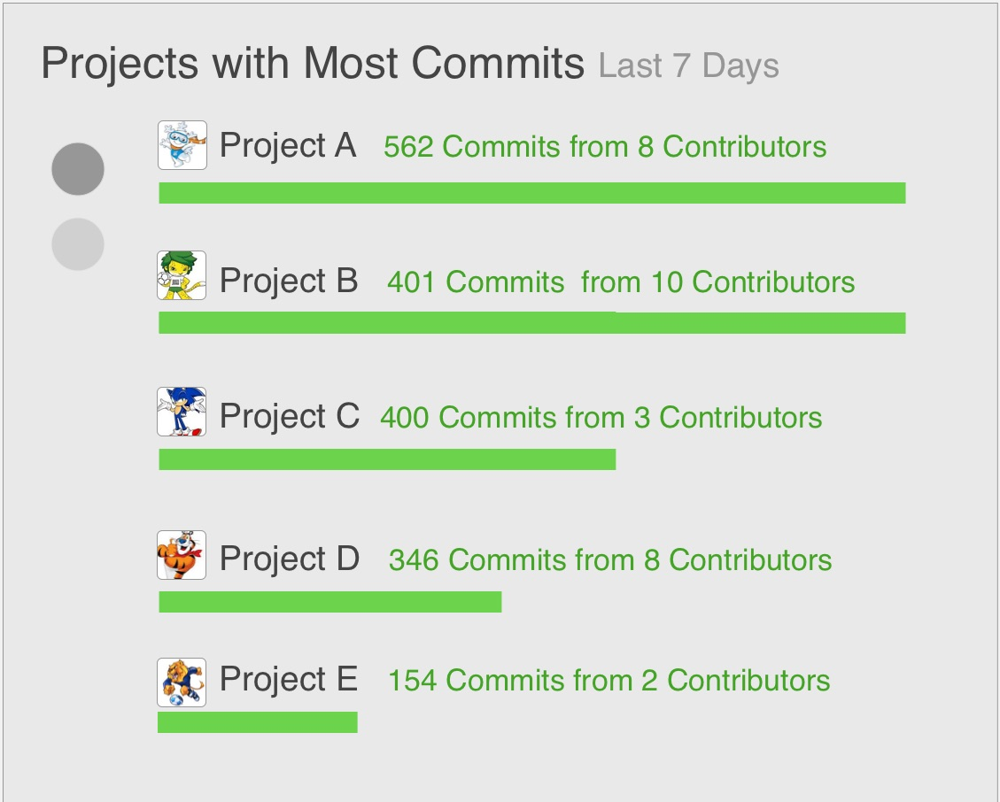
        </a>
    

    

    <a href="https://github.com/EMC-UI/emc-hackathon-tweets" target="\_blank">
            <h5>#Hashtag Tweetstream</h5>
            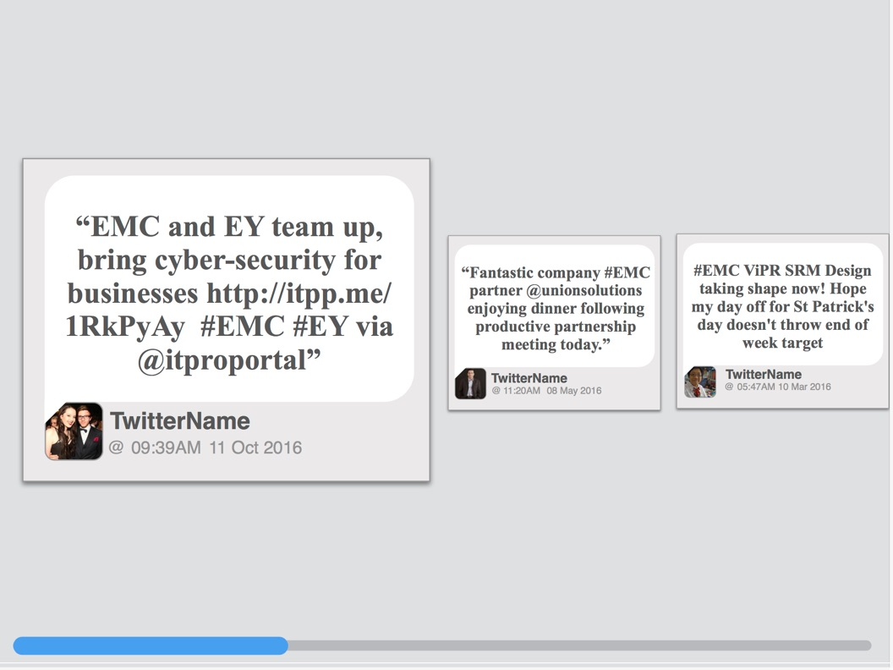
        </a>
    

    

        <a href="https://github.com/EMC-UI/coffee-monitor" target="\_blank">
            <h5>Homegrown Coffee API</h5>
            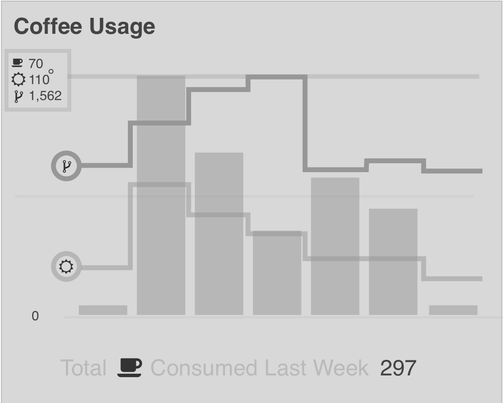
        </a>
    

- *Out in the Open* - Nothing motivates quite like lasting impact. Find under-developed, prominent within the organization and   We focused on logistics and dashboard displays for the monitors peppered throughout EMC’s The suggested projects should be out on display for everyone. Our approach was to emphasize the EMC Dashboard monitors that are displayed throughout the site.

- *Mix-And-Match Teams* - Over 50% of the signups were beginners and intermediate coders. To hedge against greener developers getting lost down a rabbit hole, appoint experience team captains and divide green and seasoned attendees evenly across the teams.

<!-- 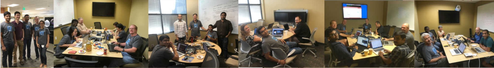
{: .wide  } -->
This was one of the most successful strategies at EMC.

## Promoting the Event

We were concerned about attendance. Believe it or not, hackathons were an unfamiliar concept to some employees and upper management, so we started an inter-office gorilla marketing campaign that pushed the subversive fun of it, we well as educated people about its purpose.

### Event Logo and Swag

    

        <h5>Process</h5>
        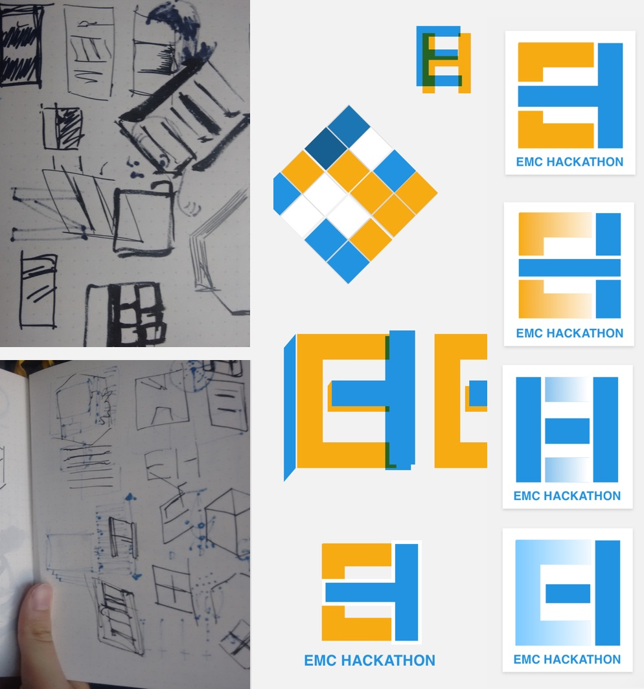
    

    

        <h5>Final</h5>
        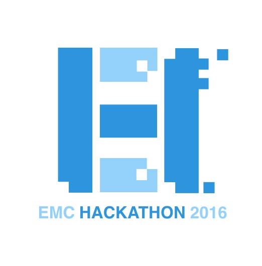
    

    

        <h5>T-shirts</h5>
        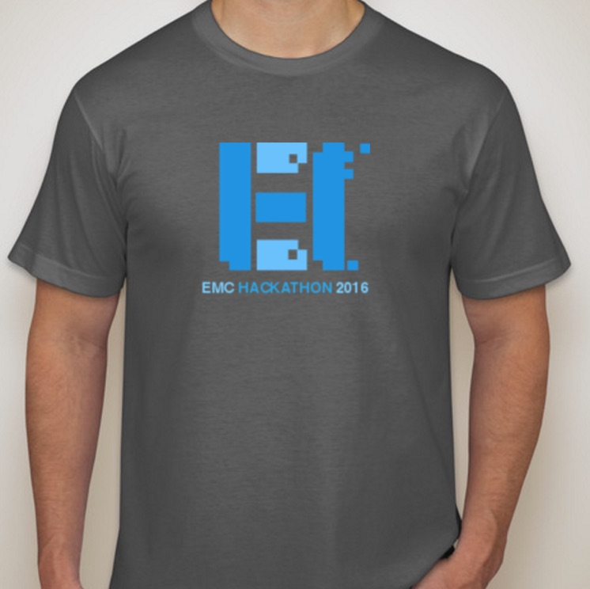
        

    

        <h5>Stickers</h5>
        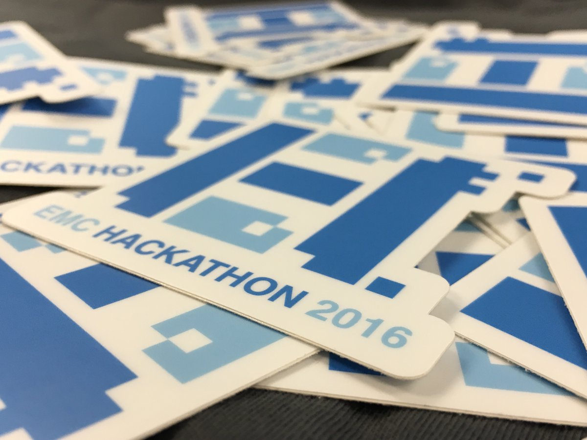
    

### Posters
{: .wide }
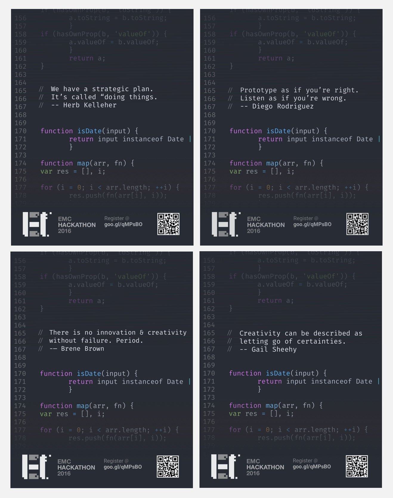
{: .wide }

### Hack the Monitors

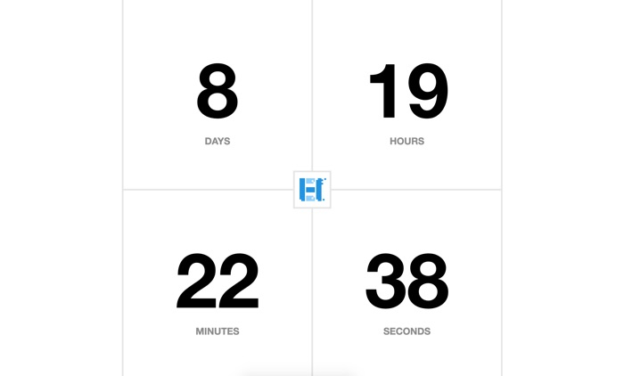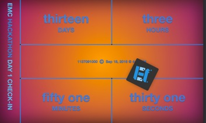!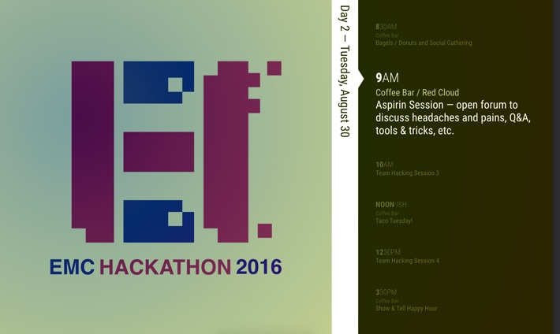
{: .wide .tile-2 .flex}

## The Big Day

### Take Aways
