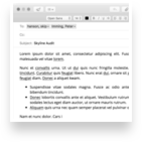
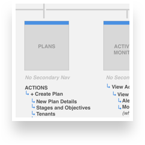
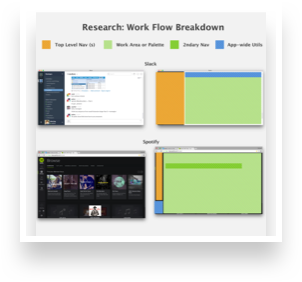
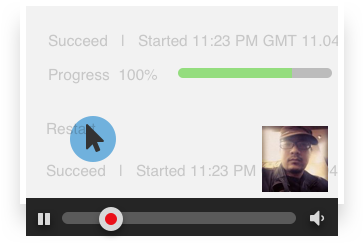
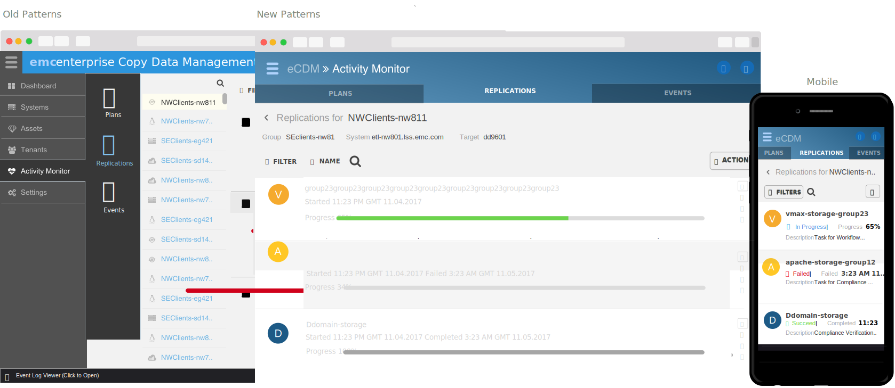
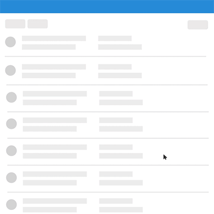
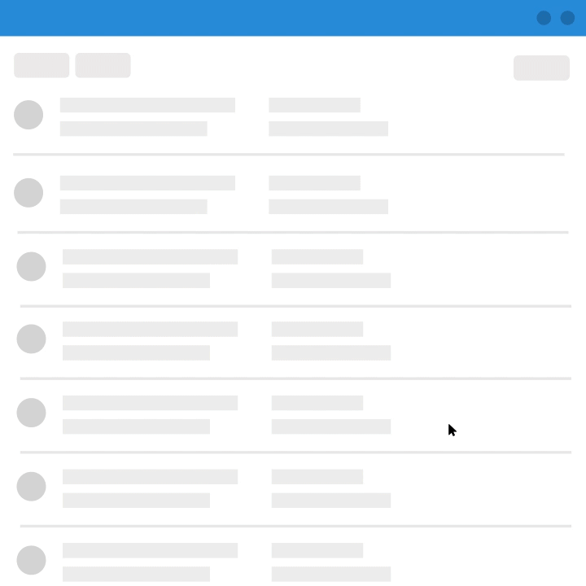
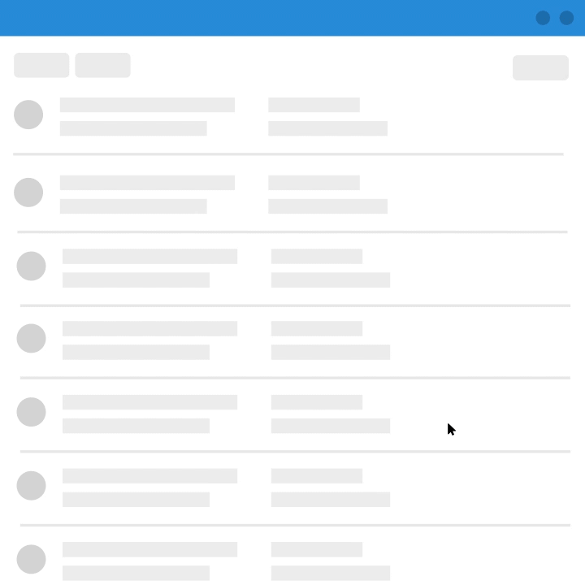

## The Problem

> ”How do you build a flexible navigation while the road map could be anything?”

This is one of the questions UI/UX Services at EMC has been answering over the last 6 months. We were tasked with designing a bullet-proof information hierarchy and navigational structure for three ongoing applications with radically different feature-sets.

## Guiding Principles
Over three meetings, we presented research and reviewed the types of interactions and structures most common to EMC products. When research concluded, three unifying principles emerged out of the dialog to guide the following solutions.

- **Flexibility** - Because some feature’s complexity approaching that of stand-alone applications in other fields, extendibility became a key focus for our team.

- **Clutter-Free** - The actions and management of complex data flows also necessitated a toolset and navigation that was out of the way when not needed, providing users of all screen sizes (desktop and mobile) a distraction-free workspace.

- **Powerful** - “Power user” is an attribute of two of our three most common Personas, so a smart navigation that provided access to 2nd, 3rd and ancillary data points was also a must-have.

<!-- ### Methodology

    

        

            <h5>Audit</h5>
            
            
Over email and confluence, we pulled a full audit of the applications using EMC-UI.

        

        

            <h5>Feature Mapping</h5>
            
            
Over whiteboards and Sketch, we laid out maps of each application. We circled common patterns and data structures and used those as starting points to design from.

        

        

            <h5>Research</h5>
            
            
Prototyping and research into context, as well as

        

        

            <h5>Testing</h5>
            
            
This is the text here, this is what we're talking now.

        
     
    
   

 -->

### The Results
After 6 months, we delivered the last of our framework changes to EMC-UI.

    

### Omni-Nav
We settled on an Omni-Navigational window, build out with each mini-application inside the main pain, as well as system Utilities.

{: .center }

The omni-search at the top works from an index of the entire site; you can access pages 2 or 3 levels deep within that single page, as well as Tags and Events thrown by the Application itself.

**Details** We spent an extra hour and a half adding hotkeys  for opening, searching and traversing the omni-panel. We had a lot of fun adding in these little details for the power user personas.

### Secondary Nav
The secondary navigation was actually the last piece of the puzzle we committed to. We iterated through 4 different approaches before we landed the final solution. The prototype below, coded by <a href="codepen.com/jasesmith">Jase Smith</a> was one of the tests we threw against the solution.

See the Pen <a href="http://codepen.io/jasesmith/pen/RraJwJ/">UI Concept: The Whale</a> by Jase (<a href="http://codepen.io/jasesmith">@jasesmith</a>) on <a href="http://codepen.io">CodePen</a>.

<!-- ### Action Bar

{: .center } -->

### App Utilities
Rounding out the approach were the utilities attached to each view, Multi-Select Actions, Notifications and site-wide Searching.

  
{: .wide .tile-3 }

<!-- {: .wide }
Testing, this is a test, test cool.  Testing 2.
{: .block .wide } -->

## Results
We’re still reaping the rewards of a thorough design process around our navigation and utility exploration. As we head into the design planning phase of V2, we’re finding very few navigational patterns that don’t fit neatly into our proven design patterns. We’ve partnered with a separate UX Researchers organization within EMC to verify our results in broader contexts. Their initial reviews of our work indicate they’re “light years ahead” of what was previously available.

We’re not done yet. EMC-UI was adopted as DPAS's UX standard and being consumed by multiple software teams across the world. As we continue to test V1 of both projects, we’ll continue to refine these examples. 2016 looks to be another great year for solving difficult problems and making people’s lives better.
